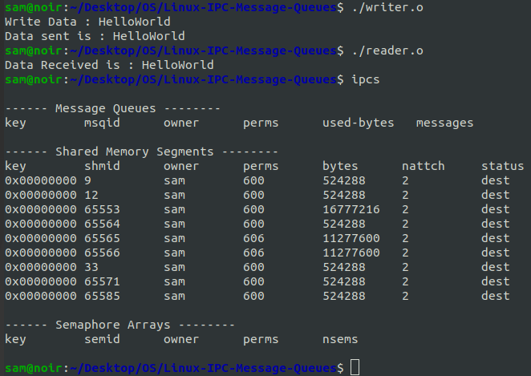

# Linux-IPC-Message-Queues
Linux IPC-Message Queues

# AIM:
To write a C program that receives a message from message queue and display them

# DESIGN STEPS:

### Step 1:

Navigate to any Linux environment installed on the system or installed inside a virtual environment like virtual box/vmware or online linux JSLinux (https://bellard.org/jslinux/vm.html?url=alpine-x86.cfg&mem=192) or docker.

### Step 2:

Write the C Program using Linux message queues API 

### Step 3:

Execute the C Program for the desired output. 

# PROGRAM:

```
Name   : Sam Israel D
Reg No : 212222230128
```

## C program that receives a message from message queue and display them

#### writer.c
```c
#include <stdio.h> 
#include <sys/ipc.h> 
#include <sys/msg.h> 
#include <string.h> // Added for string functions

// Structure for message queue 
struct mesg_buffer { 
	long mesg_type; 
	char mesg_text[100]; 
} message; 

int main() { 
	key_t key; 
	int msgid; 
	
	// ftok to generate unique key 
	key = ftok("progfile", 65); 
	if (key == -1) { // Check for ftok error
		perror("ftok");
		return 1;
	}
	
	// msgget creates a message queue and returns identifier 
	msgid = msgget(key, 0666 | IPC_CREAT); 
	if (msgid == -1) { // Check for msgget error
		perror("msgget");
		return 1;
	}
	
	message.mesg_type = 1; 
	printf("Write Data : "); 
	fgets(message.mesg_text, sizeof(message.mesg_text), stdin); 
	// Remove trailing newline from fgets input
	message.mesg_text[strcspn(message.mesg_text, "\n")] = '\0';
	
	// msgsnd to send message 
	if (msgsnd(msgid, &message, sizeof(message), 0) == -1) { // Check for msgsnd error
		perror("msgsnd");
		return 1;
	}
	
	// Display the message 
	printf("Data sent is : %s \n", message.mesg_text); 
	return 0; 
}

```
#### reader.c
```c
#include <stdio.h>
#include <sys/ipc.h>
#include <sys/msg.h>

// structure for message queue
struct mesg_buffer {
	long mesg_type;
	char mesg_text[100];
} message;
int main()
{
	key_t key;
	int msgid;
// ftok to generate unique key
	key = ftok("progfile", 65);
	// msgget creates a message queue
	// and returns identifier
	msgid = msgget(key, 0666 | IPC_CREAT);
	// msgrcv to receive message
	msgrcv(msgid, &message, sizeof(message), 1, 0);
	// display the message
	printf("Data Received is : %s \n",
			message.mesg_text);

	// to destroy the message queue
	msgctl(msgid, IPC_RMID, NULL);
	return 0;
}

```


## OUTPUT



# RESULT:
The programs are executed successfully.
